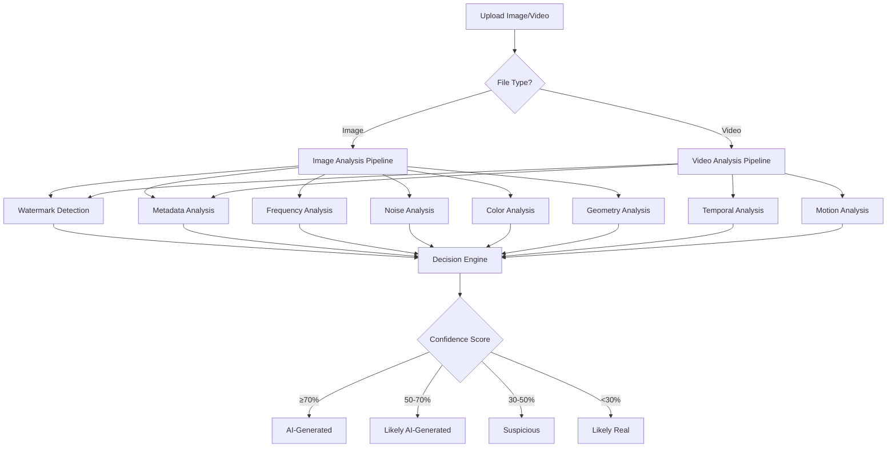

# 🔍 AI Content Detection System

[](https://www.python.org/downloads/)
[](https://fastapi.tiangolo.com/)
[](https://opensource.org/licenses/MIT)
[](https://github.com/yourusername/ai-detection)

> **⚠️ Early Development Stage**: This project is in active development. Thresholds and detection methods are being continuously refined based on real-world testing.

A **model-free**, deterministic system for detecting AI-generated images and videos without using any machine learning models. Uses statistical analysis, frequency domain inspection, and metadata examination to identify synthetic content.

## 🎯 Key Features

- ✅ **No ML Models** - Pure algorithmic detection (no CNN, Transformer, CLIP, or ViT)
- ✅ **CPU-Only** - No GPU required, runs anywhere
- ✅ **Explainable Results** - Every detection comes with evidence
- ✅ **Multi-Format Support** - Images (JPG, PNG, WEBP) and Videos (MP4, MOV, AVI)
- ✅ **Modern Web UI** - Drag-and-drop interface with real-time analysis
- ✅ **REST API** - Easy integration with existing systems
- ✅ **Fast Mode** - Quick analysis for batch processing

## 📊 How It Works



## 🔬 Detection Modules

### 1. Watermark & Metadata Analysis (Priority #1)
- **Visible Watermarks**: Corner/edge logo detection using template matching
- **Invisible Watermarks**: FFT/DCT frequency domain pattern scanning
- **LSB Steganography**: Chi-square test for least significant bit anomalies
- **Metadata Inspection**: EXIF/XMP/C2PA analysis for AI software tags
- **File Structure**: PNG chunks, JPEG segments, MP4 atoms examination

### 2. Frequency Domain Analysis
- **DCT Ratio**: High/low frequency energy ratio (AI: <0.10, Real: >0.20)
- **Checkerboard Pattern**: Diffusion model upsampling artifacts
- **GAN Grid Artifacts**: 8x8 or 16x16 block boundary detection

### 3. Noise & Sensor Analysis
- **Noise Variance**: Sensor noise patterns (AI: <5, Real: >10)
- **Noise Entropy**: Distribution randomness testing
- **Local Variance Map**: Homogeneity detection across image regions
- **Chi-Square Test**: Pixel value distribution analysis

### 4. Color & Light Analysis
- **RGB Correlation**: Channel correlation (AI: >0.95, Real: 0.7-0.92)
- **Color Cast**: Histogram mode uniformity
- **Saturation**: Extreme saturation detection

### 5. Geometry & Structure
- **Edge Coherence**: Hough transform line continuity
- **Symmetry**: Unnatural pattern repetition
- **Perspective**: Vanishing point consistency

### 6. Video-Specific Analysis
- **Temporal Flicker**: 2-5 Hz FFT peak detection (diffusion characteristic)
- **Frame Correlation**: Noise consistency between frames
- **Motion Vectors**: Optical flow irregularity detection
- **Temporal Noise**: Frame-to-frame noise standard deviation

## 🚀 Quick Start

### Installation

```bash
# Clone repository
git clone https://github.com/yourusername/ai-detection.git
cd ai-detection

# Install dependencies
pip install -r requirements.txt
```

### Running the System

**Windows:**
```bash
start.bat
```

**Linux/Mac:**
```bash
chmod +x start.sh
./start.sh
```

**Manual:**
```bash
# Terminal 1: Start backend
python run_server.py

# Terminal 2: Open frontend
python open_app.py
```

### Access Points

- **Web UI**: http://localhost:8000
- **API Docs**: http://localhost:8000/docs
- **Health Check**: http://localhost:8000/api/v1/health

## 📡 API Usage

### Single File Analysis

```bash
curl -X POST "http://localhost:8000/api/v1/detect" \
  -F "file=@image.jpg"
```

### Python Example

```python
import requests

with open('image.jpg', 'rb') as f:
    files = {'file': ('image.jpg', f, 'image/jpeg')}
    response = requests.post('http://localhost:8000/api/v1/detect', files=files)
    result = response.json()

print(f"Verdict: {result['verdict']}")
print(f"Confidence: {result['confidence']:.1%}")
print(f"Evidence: {result['evidence']}")
```

### Response Format

```json
{
  "verdict": "AI-Generated",
  "confidence": 0.87,
  "total_score": 145,
  "scores": {
    "watermark_detected": 100,
    "metadata_suspicious": 40,
    "freq_ratio_anomaly": 30
  },
  "evidence": [
    "C2PA metadata indicates synthetic origin",
    "Diffusion checkerboard pattern detected",
    "Unnaturally low noise variance"
  ],
  "processing_time_ms": 1523
}
```

## 🎨 Web Interface

<div align="center">
  
</div>

**Features:**
- Drag & drop file upload
- Multi-file support (up to 10 files)
- Real-time analysis progress
- Detailed verdict visualization
- Evidence breakdown
- Fast mode toggle

## 📈 Verdict Determination

The system uses **confidence score** (0-1) to determine the verdict:

| Confidence | Verdict | Interpretation |
|------------|---------|----------------|
| ≥ 0.70 | **AI-Generated** | High certainty of synthetic origin |
| 0.50 - 0.70 | **Likely AI-Generated** | Strong indicators present |
| 0.30 - 0.50 | **Suspicious** | Some anomalies detected |
| < 0.30 | **Likely Real** | Appears to be authentic |

## ⚙️ Configuration & Tuning

### Threshold Adjustment

Edit `ai_detector/decision/thresholds.py`:

```python
ANALYSIS_THRESHOLDS = {
    'dct_freq_ratio_ai_max': 0.10,      # Lower = fewer detections
    'noise_variance_ai_max': 5.0,       # Lower = fewer detections
    'rgb_correlation_ai_min': 0.95,     # Higher = fewer detections
    'checkerboard_threshold': 0.25,     # Higher = fewer detections
}
```

See [TUNING.md](TUNING.md) for detailed configuration guide.

## 🧪 Testing

```bash
# Simple test with random image
python test_simple.py

# Test with your own file
python test_api.py your_image.jpg

# Batch testing
python test_api.py image1.jpg image2.png video.mp4
```

## 📊 Current Limitations

### Known Issues

1. **False Positives**
   - Heavily edited photos (Photoshop/Lightroom)
   - Photos with aggressive noise reduction
   - Compressed/re-encoded images

2. **False Negatives**
   - AI images with watermarks removed
   - Novel AI generators not in detection database
   - Adversarially perturbed images

3. **Performance**
   - Video analysis: ~100 frames max (configurable)
   - Large files: Processing time increases linearly
   - Fast mode: Skips some tests for speed

### Accuracy Expectations

Based on initial testing:

| Content Type | Expected Accuracy |
|--------------|-------------------|
| AI with watermark | ~95% |
| AI without watermark | ~70-80% |
| Real photos | ~85-90% |
| Edited photos | ~60-70% |

> **Note**: These are preliminary estimates. Comprehensive testing is ongoing.

## 🛣️ Roadmap

### Phase 1: Core Detection (Current)
- [x] Basic watermark detection
- [x] Metadata analysis
- [x] Frequency domain analysis
- [x] Noise analysis
- [x] Web interface
- [x] REST API

### Phase 2: Enhanced Detection (In Progress)
- [ ] Platform-specific watermark templates database
- [ ] Improved C2PA parsing
- [ ] Advanced GAN fingerprinting
- [ ] Video codec analysis
- [ ] Batch processing optimization

### Phase 3: Advanced Features (Planned)
- [ ] Real-time video stream analysis
- [ ] Browser extension
- [ ] Mobile app
- [ ] Cloud deployment templates
- [ ] Comprehensive test dataset
- [ ] Accuracy benchmarking suite

### Phase 4: Research & Innovation (Future)
- [ ] Novel AI generator detection
- [ ] Adversarial robustness testing
- [ ] Cross-platform watermark database
- [ ] Community contribution system
- [ ] Academic paper publication

## 🤝 Contributing

Contributions are welcome! This project is in early development and needs:

- **Test Data**: Real photos and AI-generated images for testing
- **Threshold Tuning**: Help calibrate detection thresholds
- **New Detection Methods**: Novel algorithmic approaches
- **Bug Reports**: Issues with false positives/negatives
- **Documentation**: Improvements and translations

See [CONTRIBUTING.md](CONTRIBUTING.md) for guidelines.

## 📚 Documentation

- [START_HERE.md](START_HERE.md) - Quick start guide
- [ARCHITECTURE.md](ARCHITECTURE.md) - System architecture
- [TUNING.md](TUNING.md) - Threshold configuration
- [DEPLOYMENT.md](DEPLOYMENT.md) - Production deployment
- [IMPORTANT_NOTES.md](IMPORTANT_NOTES.md) - Recent changes

## 🔧 Technical Stack

- **Backend**: FastAPI, Python 3.9+
- **Image Processing**: OpenCV, NumPy, SciPy, Pillow
- **Frontend**: Vanilla JavaScript, HTML5, CSS3
- **No ML Frameworks**: No TensorFlow, PyTorch, or ONNX

## 📄 License

MIT License - see [LICENSE](LICENSE) file for details.

## 🙏 Acknowledgments

- Inspired by research on PRNU analysis (IEEE TIFS)
- DCT forensics techniques (IEEE Signal Processing Magazine)
- C2PA standard (contentauthenticity.org)
- Diffusion artifact detection (CVPR 2023)
- GAN fingerprinting research (ACM CCS 2020)

## 📞 Contact & Support

- **Issues**: [GitHub Issues](https://github.com/yourusername/ai-detection/issues)
- **Discussions**: [GitHub Discussions](https://github.com/yourusername/ai-detection/discussions)
- **Email**: your.email@example.com

## ⚠️ Disclaimer

This tool is provided for research and educational purposes. Detection accuracy is not guaranteed. Always verify results with multiple methods. The system is in active development and thresholds are being continuously refined.

---

<div align="center">
  <strong>Built with ❤️ for transparency in digital media</strong>
  <br>
  <sub>No ML models • CPU-only • Explainable results</sub>
</div>
